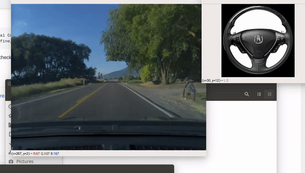

selfdrive
==================

## Install:
<pre>
sudo ./preperation/cereal/install_capnp.sh
</pre>
## Data
Now you need to download the commaai dataset from [here](http://academictorrents.com/details/65a2fbc964078aff62076ff4e103f18b951c5ddb)
you will get 10 files labeled from Chunk1.zip to Chunk10.zip. Choose one and unpack it into the
data folder. In the data folder should now be folders with name 2019-0.... etc. Then you have to read 
them. 
<pre>
cd data/
python ../preperation/reader.py ./ ../unpacked_data
</pre> 

You can change the last argument to whereever you want to save your .npy files. So the training files.
Keep in mind that you will have to remember this folder. Now the unpacked_data folder should be filled with files. Once that is done we can move onto the next step.

## Training 
<pre>
python3 train.py ./unpacked_data/
</pre>
this will give you two files once it's done. The first file "learning.h5" gets updated every epoch. The second file "final.h5" will be the final version and generated when the training is over. Both are the same at the end. They have the same weights in them.

## Testing 
<pre>
python3 app.py <path-to-video-driving-file> final.h5
</pre>

If you encounter any issues feel free to post them. Have fun !

